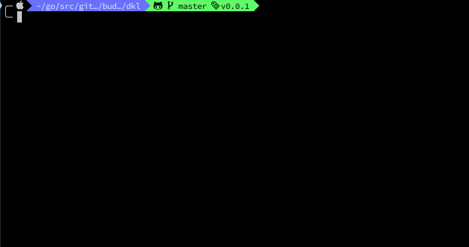

# dkl
Pure Go implementation of [dtt][dtt].

## Description
Pure Go implementation of [dtt][dtt].  
dkl is the text-mode interface for docker and kubectl command. dkl shows containers(or pods), and exec(login) selected it.

## Demo & VS.


## Requirement
Need `docker`, and `kubectl` commands.

## Usage

```
$ dkl -h
Usage of dkl:
  -d    list docker containers and exec selected container.
  -docker
        list docker containers and exec selected container.
  -k    list pods and exec selected pod.
  -kubernetes
        list pods and exec selected pod.
  -v    Print version information and quit.
  -version
        Print version information and quit.
```

## Install
You can download binary from [release page](https://github.com/budougumi0617/dkl/releases) and place it in $PATH directory.

### MacOS
If you want to install on MacOS, you can use Homebrew.
```
brew install budougumi0617/tap/dkl
```


## Contribution
1. Fork ([https://github.com/budougumi0617/dkl/fork](https://github.com/budougumi0617/dkl/fork))
2. Create a feature branch
3. Commit your changes
4. Rebase your local changes against the master branch
5. Run test suite with the `go test ./...` command and confirm that it passes
6. Run `gofmt -s`
7. Create new Pull Request

## License

[MIT](https://github.com/budougumi0617/dkl/blob/master/LICENSE)

## Author
[budougumi0617](https://github.com/budougumi0617)

[dtt]: https://github.com/ymizushi/dtt
